You’re a brave explorer, navigating a minefield one click at a time. Each revealed square gives you a hint – a number revealing how many mines lurk nearby. Can you use your wits to avoid the deadly traps, flag the dangerous squares, and clear the board before it's too late?

I wish I could mention the original creator of this fantastic game, however the origin seems unknown. I am using the [playstore version](https://play.google.com/store/apps/details?id=Draziw.Button.Mines&hl=en_IN) in this blog, created by Evkar Games.

# How does MineSweeper Work?
The game is pretty straightforward - you are given a grid of cells, each of which may or may not contain a mine. If you click on a cell that has a mine, it's game over. If you click on a one that is not, cells around it open up revealing a number. This number tells you the number of mines around it. The goal of the game is to uncover all cells without the mines.

# How Does This Particular Version Work?
The android game is written in Unity. Most of the logic of the game is in the `minesweeper.Button.Mines` package. It also has a few extra games in it (2048, blockpuzzlerotate) that are unlocked as you win.
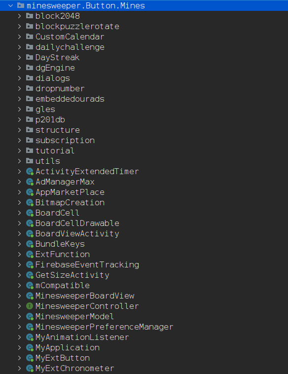

To figure out which Class handles loading the game, I used frida-trace. `frida-trace -UFj 'minesweeper.Button.Mines.*!onCreate'`. This works by attaching frida to a running instance of the game, and tracing all calls for the onCreate method, called for any class defined in the `minesweeper.Button.Mines` package.
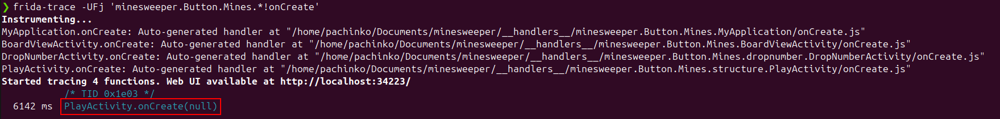

The `PlayActivity` handles setting up the game. This class has a reference to the `Model` class which seems to be very important. It calls functions and methods like GamePlay, BoardType, etc. Looking at this class, we see it defines a few interesting members.
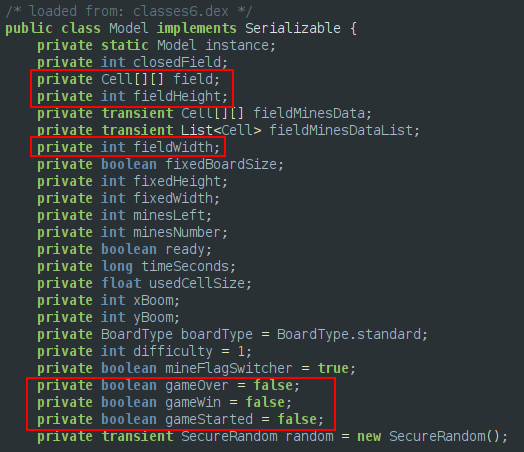

It also has an inner-class called `Cell`, that handles every cell on the grid.
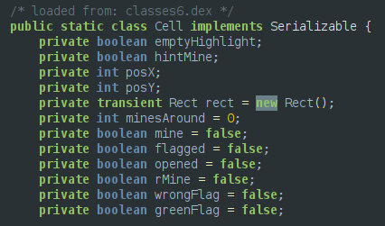

# Flagging All Mines
So the `Cell` class has a method called `setFlagged` which manipulates the `flagged` boolean. I assume this is what is called when you mark a suspected cell as a mine. There is also another boolean called `mine` that keeps track of weather or not a cell is a mine.
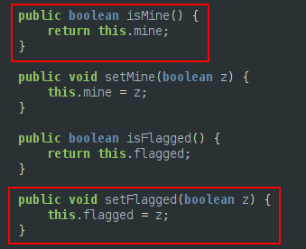

Keeping these things in mind, lets write a Frida script that will flag all the mines for us.
```js
// flag all mines
function flagAllMines() {
	Java.perform(() => {
		Java.choose("minesweeper.Button.Mines.structure.Model", {
			onMatch: (model) => {
				console.log("[!] Found: " + model);
				let width = model.getFieldWidth();
				let height = model.getFieldHeight();
				console.log(`Width: ${width}, Height: ${height}`);
				let field = model.field.value;
				field.forEach(row => {
					let newrow = row.map(cell => {
						// flag the cell if it is a mine
						if (cell.mine.value) {
							cell.setFlagged(true);
						}
						// convert bool to int for cleaner map
						return cell.mine.value ? 1 : 0;
					});
					// print mine field
					console.log(newrow);
				});
			},
			onComplete: () => {
				console.log("[*] Done");
			}
		});
	});
}
```

The `flagAllMines` function gets an instance of the `Model` class, then prints it's width and height. Then for each cell in the row, if the cell is a mine, it flags the cell by calling the `setFlagged` method. It also prints a nice grid of 1's and 0's to give us a nice representation of the minefield. `frida -UFl script.js`
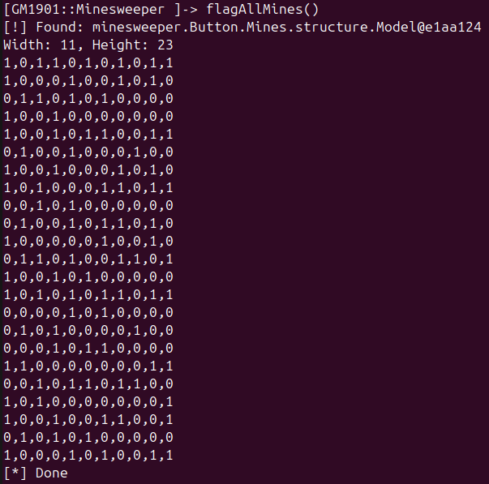

But nothing happens in the game for some reason?
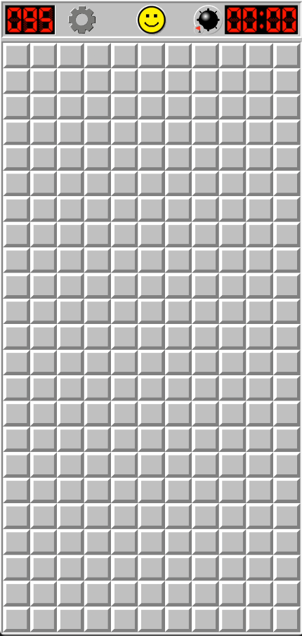

The moment you click any cell, the entire grid immediately updates and reveals all the mines.
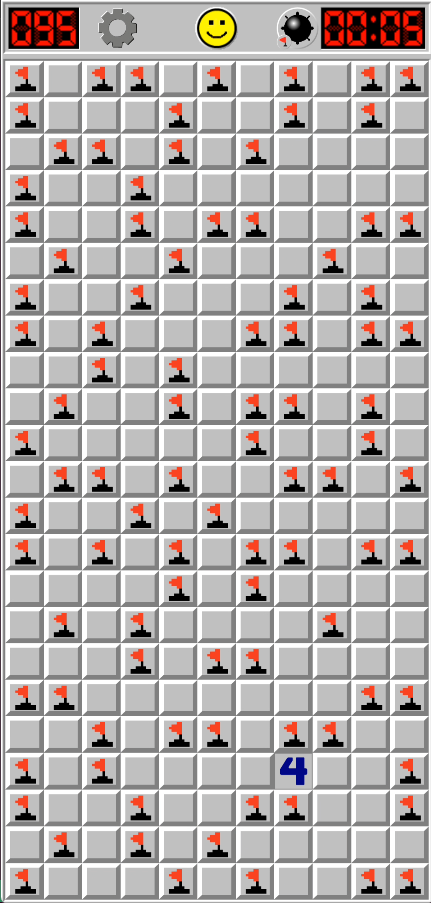

# Winning The Game
While looking at the code, I came across this `MinesweeperPlay` class that has a method `openAllAround` that takes a cell object as an argument. It looks like this is what is responsible for "opening" a cell.
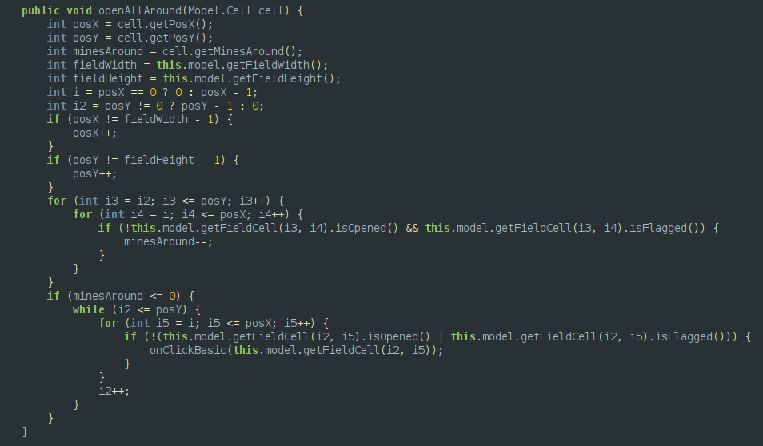

Since we already have a way to determine all mine locations, lets call this method on all cells that are not a mine. `frida -UFl script.js`
```js
// win the game
function winGame() {
	Java.perform(() => {
		Java.choose("minesweeper.Button.Mines.structure.Model", {
			onMatch: (model) => {
				console.log("[!] Found: " + model);
				let width = model.getFieldWidth();
				let height = model.getFieldHeight();
				console.log(`Width: ${width}, Height: ${height}`);
				let field = model.field.value;
                Java.choose("minesweeper.Button.Mines.structure.MinesweeperPlay", {
					onMatch: (minesweeperplay) => {
						field.forEach(row => {
							let newrow = row.map(cell => {
							// flag the cell if it is a mine
								if (cell.mine.value) {
									cell.setFlagged(true);
								} else {
									minesweeperplay.openAllAround(cell);
								}
								// convert bool to int for cleaner map
								return cell.mine.value ? 1 : 0;
							});
					// print mine field
						console.log(newrow);
						});
					},
					onComplete: () => {
						setTimeout(()=>{}, 500);
					}
				});
			},
			onComplete: () => {
				console.log("[*] Done");
			}
		});
	});
}
```
As soon as the `winGame` cheat is called, we see the game essesntially auto-completes.
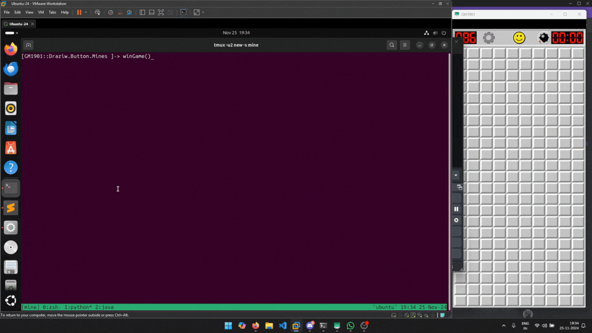

# Bonus: Scaling The Grid
This idea came through when I showed this thing to a friend. "Can you resize that grid?" he asked. So I decided to look through at how the grid size is determined. Turns out the `Model` class has a `createField` method that takes 3 arguments: width, height and `BoardType`. So quickly wrote a script that changes the implementation of this method. It grabs an instance of the `Model` class, and then calls the `createField` method with our custom width and height. The `BoardType` is copied to from the original method call.
```js
// Change grid size
function setGrid(x, y) {
	Java.perform(() => {
		let Model = Java.use("minesweeper.Button.Mines.structure.Model");
		let Cell = Java.use("minesweeper.Button.Mines.structure.Model$Cell");
		Model.createField.implementation = (arg1, arg2, arg3) => {
			console.log("[+] Modifying createField")
			Java.choose("minesweeper.Button.Mines.structure.Model", {
				onMatch: (instance) => {
					console.log("[+] Found: " + instance);
					instance.createField(x, y, arg3);
				},
				onComplete: () => {
					console.log("[+] Done!")
				}
			});
		}
	});
}
```

Yea it's pretty stupid.
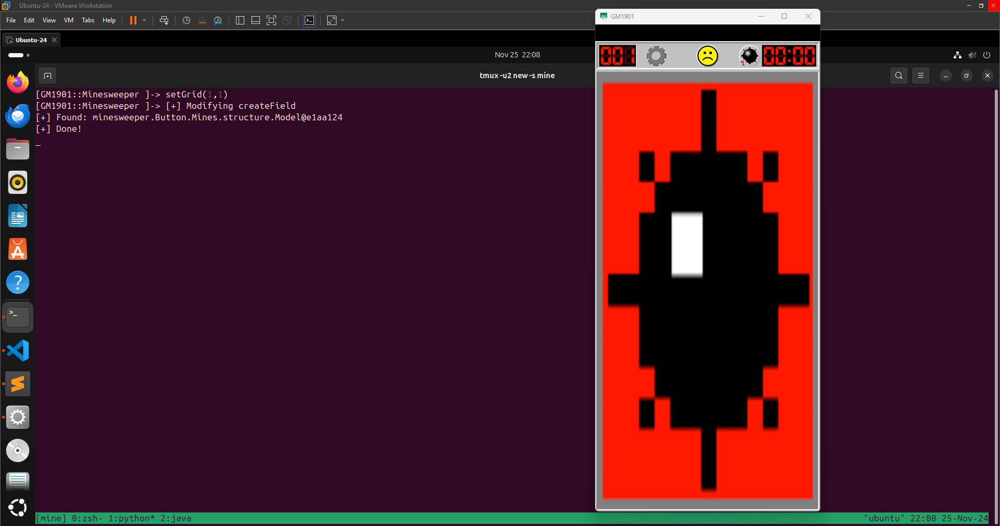

Perhaps there's more to explore, but that is for some other time.
