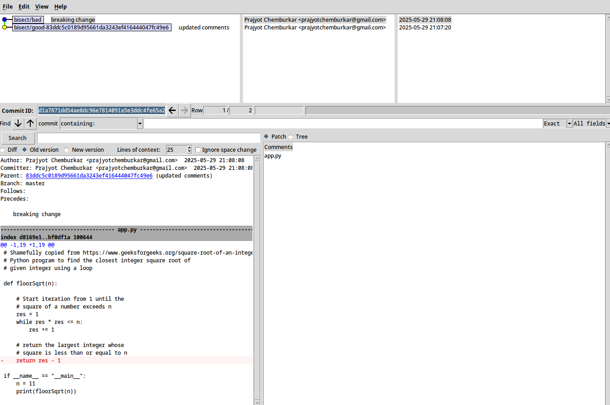

*Git is a free and open source distributed version control system designed to handle everything from small to very large projects with speed and efficiency. Git is easy to learn and has a tiny footprint with lightning fast performance. It outclasses SCM tools like Subversion, CVS, Perforce, and ClearCase with features like cheap local branching, convenient staging areas, and multiple workflows.*
~[Git's Official Website](https://git-scm.com)

If you are a developer, it is impossible to have not heard for Git. It is the most popular version control system, with a market share of ~80% according to [OpenHub](https://openhub.net/repositories/compare). The most popular software hosting solutions (GitHub, GitLab, BitBucket) use Git as the primary version control.

# Git Bisect
I've been looking at Git for the past few months for *reasons* and this one feature made me realise how well thought Git really is.

[Git-Bisect](https://git-scm.com/docs/git-bisect) is a feature that uses binary search to find the commit that introduced a bug.

You start with marking the bad commit, and the last known good commit where your feature works. Git automatically starts checking out commits between the two commits you specified. You can now test your feature in every checkout and mark that commit as bad or good, and in the end, git will point to the exact commit that introduced your bug.

Let's take an easy example. The following code simply calculates the closest integer candidate for the square root of a given number.
```python
# Shamefully copied from https://www.geeksforgeeks.org/square-root-of-an-integer/
# Python program to find the closest integer square root of 
# given integer using a loop

def floorSqrt(n):
    
    # Start iteration from 1 until the 
    # square of a number exceeds n
    res = 1
    while res * res <= n:
        res += 1
    
    # return the largest integer whose 
    # square is less than or equal to n
    return res - 1

if __name__ == "__main__":
    n = 11
    print(floorSqrt(n))
```

And the test case for the above program
```python
rom app import floorSqrt

def test_floorSqrt():
    assert floorSqrt(16) == 4, "Test failed, floorSqrt(16)"
    assert floorSqrt(11) == 3, "Test failed, floorSqrt(11)"
    assert floorSqrt(28) == 5, "Test failed, floorSqrt(11)"
    assert floorSqrt(640) == 25, "Test failed, floorSqrt(640)"

if __name__ == "__main__":
    test_floorSqrt()
    print("Tests Passed")
```

I've added this code into a git repository over 20 commits. One of these commits introduces a bug that does not return the right integer. Set the good and bad commits:
```bash
# Start bisecting
$ git bisect start
status: waiting for both good and bad commits

# Mark the current revision as bad
$ git bisect bad
status: waiting for good commit(s), bad commit known

# Mark the last known good revision
$ git bisect good 7973b896fc95d738b2cb0b5ddf95c148991fc203
Bisecting: 8 revisions left to test after this (roughly 3 steps)
[41c5fdda8fb6ba0b0164f2d40b95d67f6358b907] updated comments
```

Git lets us know that 8 commits need to be tested. It also automatically checks out to the commit that you need to test.
```bash
# Test the commit
$ python3 app.test.py
Tests Passed

# Tests passed. So mark the commit as good
$ git bisect good

# Test the commit
$ python3 app.test.py
Traceback (most recent call last):
  File "/home/pachinko/Documents/Github/bisect-test/app.test.py", line 11, in <module>
    test_floorSqrt()
    ~~~~~~~~~~~~~~^^
  File "/home/pachinko/Documents/Github/bisect-test/app.test.py", line 4, in test_floorSqrt
    assert floorSqrt(16) == 4, "Test failed, floorSqrt(16)"
           ^^^^^^^^^^^^^^^^^^
AssertionError: Test failed, floorSqrt(16)

# Tests failed. So mark the commit as bad.
$ git bisect bad
Bisecting: 0 revisions left to test after this (roughly 0 steps)
```

Continue to do this, until git-bisect arrives at the exact commit that introduced your bug.
```bash
# Marking the last commit to be tested as good / bad will give you the result
$ git bisect good
d1a7871dd54ae8dc96e7814091a5e3ddc4fe65a2 is the first bad commit
commit d1a7871dd54ae8dc96e7814091a5e3ddc4fe65a2
Author: Prajyot Chemburkar <prajyotchemburkar@gmail.com>
Date:   Thu May 29 21:08:08 2025 +0530

    breaking change

 app.py | 2 +-
 1 file changed, 1 insertion(+), 1 deletion(-)
```

Post finding the bad commit, do `git bisect reset` to return to the original HEAD.
```bash
$ git bisect reset
Previous HEAD position was 83ddc5c updated comments
Switched to branch 'master'
```

If this wasn't cool enough, Git also supports automating the entire process given you have a test case that exits with zero on success and an non-zero on a failure.
```bash
# Start bisecting
$ git bisect start
status: waiting for both good and bad commits

# Mark the current revision as bad
$ git bisect bad
status: waiting for good commit(s), bad commit known

# Mark the last known good revision
$ git bisect good 7973b896fc95d738b2cb0b5ddf95c148991fc203
Bisecting: 8 revisions left to test after this (roughly 3 steps)
[41c5fdda8fb6ba0b0164f2d40b95d67f6358b907] updated comments

# Specify the command to run for testing
# git bisect run command arguments
$ git bisect run python3 app.test.py

# Runs a test - pass
running 'python3' 'app.test.py'
Tests Passed
Bisecting: 4 revisions left to test after this (roughly 2 steps)
[dfd6678ad0a06783facf87a5aeaacab92ab05365] updated comments

# Runs a test - pass
running 'python3' 'app.test.py'
Tests Passed
Bisecting: 2 revisions left to test after this (roughly 1 step)
[d1a7871dd54ae8dc96e7814091a5e3ddc4fe65a2] breaking change

# Runs a test - fail
running 'python3' 'app.test.py'
Traceback (most recent call last):
  File "/home/pachinko/Documents/Github/bisect-test/app.test.py", line 11, in <module>
    test_floorSqrt()
    ~~~~~~~~~~~~~~^^
  File "/home/pachinko/Documents/Github/bisect-test/app.test.py", line 4, in test_floorSqrt
    assert floorSqrt(16) == 4, "Test failed, floorSqrt(16)"
           ^^^^^^^^^^^^^^^^^^
AssertionError: Test failed, floorSqrt(16)
Bisecting: 0 revisions left to test after this (roughly 0 steps)
[83ddc5c0189d95661da3243ef416444047fc49e6] updated comments

# Runs a test - pass
running 'python3' 'app.test.py'
Tests Passed

# Finds the bad commit
d1a7871dd54ae8dc96e7814091a5e3ddc4fe65a2 is the first bad commit
commit d1a7871dd54ae8dc96e7814091a5e3ddc4fe65a2
Author: Prajyot Chemburkar <prajyotchemburkar@gmail.com>
Date:   Thu May 29 21:08:08 2025 +0530

    breaking change

 app.py | 2 +-
 1 file changed, 1 insertion(+), 1 deletion(-)
bisect found first bad commit
```

# Bonus
If you like GUIs more, git bisect supports it with `git bisect visualize`
