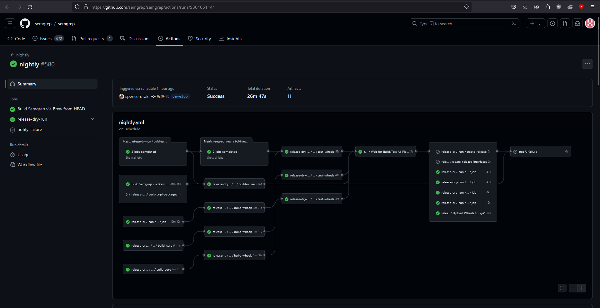
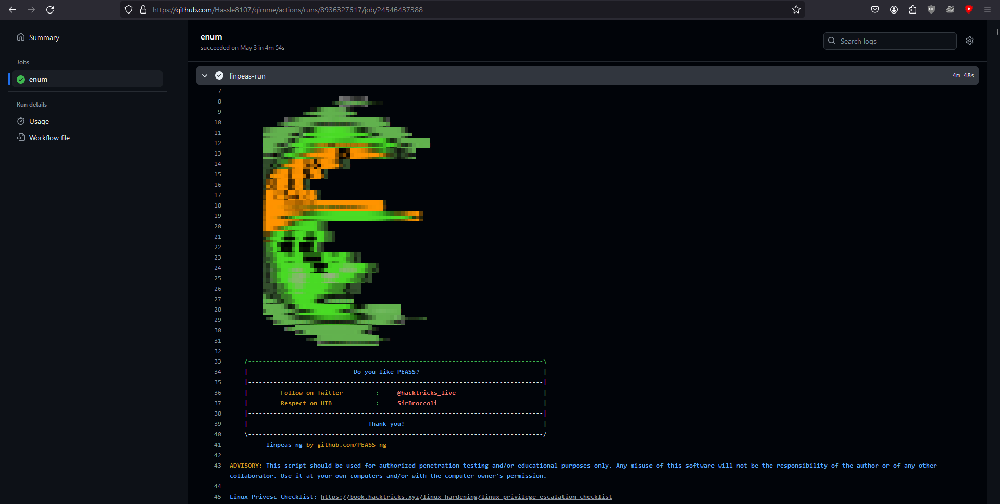
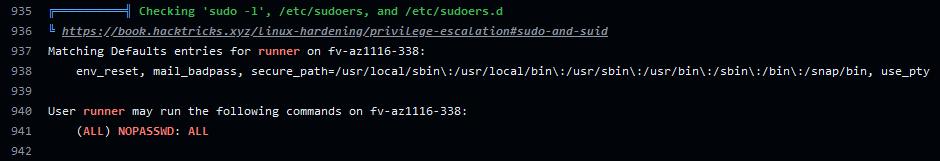
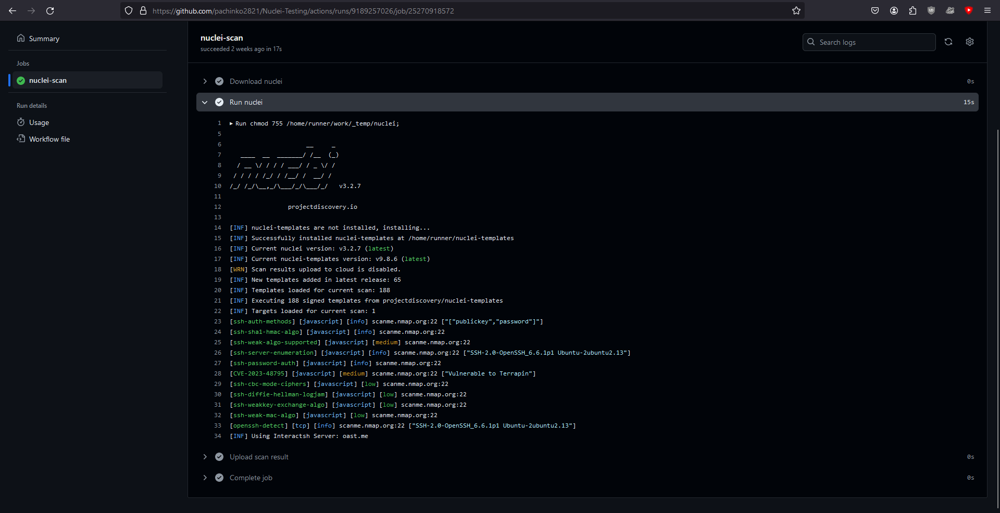

# Introduction

_Github offers hosted virtual machines to run workflows. The virtual machines contain an environment of tools, packages, and settings available for Github Actions to use._ - GitHub Docs.

Github Workflows are used by developers to automate a vast majority of tasks, like running tests, building their apps, creating releases and many other. All you need to do is create a workflow file, and Github will parse and run it as an action.


*Workflow used by semgreo for nightly builds*

Github hosted runners are available as Windows, Linux (Ubuntu) and MacOS. Using the runs-on keyword, you can specify which runner to utilize, or even specify your [self-hosted runner](https://docs.github.com/en/actions/hosting-your-own-runners/managing-self-hosted-runners/about-self-hosted-runners).

# Testing the Waters

There is no limit or restriction as to what is allowed or disallowed to be run on a Github runner. These are temporary sandboxed instances that will die once the job is completed. I ran [LinPEAS](https://github.com/peass-ng/PEASS-ng/tree/master/linPEAS) on one instance which shows that there likely isn't any kind of AV or endpoint monitoring present on these instances.


*It is possible to run LinPEAS without any issues*

Few interesting results from LinPEAS:
* You are running as a user called _runner_
* The instance is an Azure VM
* SSH is open and listening on all interfaces
* You have full sudo rights


*Full sudo rights!*

So, GitHub provides you an Azure VM with full sudo rights. There is no sign of any kind of AV or endpoint security. It is evident that these runners are meant to be use-and-throw instances.

# Unintended Use Cases

## Scanning targets with nuclei
You might want to avoid doing this. I did it purely for educational purposes and satisfy my own curiosity. I take no responsibility if you use this for any illegal activity or get your account banned. That being said, it is possible to run nuclei scans via GitHub actions.

```yml
name: 'Nuclei Scan'
on:
    push:
        branches: ["main"]
    workflow_dispatch:

jobs:
    nuclei-scan:
        runs-on: ubuntu-latest
        steps:
            - name: Download nuclei
              run: |
               wget https://github.com/projectdiscovery/nuclei/releases/download/v3.2.7/nuclei_3.2.7_linux_amd64.zip -O ${{runner.temp}}/nuclei.zip;
               unzip ${{runner.temp}}/nuclei.zip -d ${{runner.temp}}
              shell: bash

            - name: Run nuclei
              run: |
               chmod 755 ${{runner.temp}}/nuclei;
               ${{runner.temp}}/nuclei -tags network -u https://scanme.nmap.org -o ${{runner.temp}}/nuclei.out
              shell: bash

            - name: Upload scan result
              uses: actions/upload-artifact@v4
              with:
                name: nuclei-scan-result
                path: ${{runner.temp}}/nuclei.out
```

The results are available live through action logs, and once scanning is complete, you can upload the results as an artifact.


*Nuclei results are available live*

## Running SAST scans on thrid-party code
I ran scans on Jenkins plugins with Semgrep on GitHub runners. Since there is a limit of 256 parallel jobs, I wrote the workflow in a way that it picks 10 radom plugins and runs a san on them.

```yml
name: 'Jenkins Plugin Scan'
on:
    push:
        branches: ["main"]
    workflow_dispatch:

jobs:
    set-plugins:
        runs-on: ubuntu-latest
        outputs:
            plugins: ${{steps.plugins.outputs.plugins}}
        steps:
            - name: Get plugins file
              uses: actions/checkout@v4
              with:
                sparse-checkout: |
                  plugins-list.txt
                sparse-checkout-cone-mode: false

            - name: Select random plugins
              id: plugins
              run: |
                apt update && apt install jq -y;
                out="[$(shuf -n 10 plugins-list.txt |sed 's/^/\"/;s/$/\"/g' |tr '\n' ','|sed 's/,$//g')]";
                echo "plugins=$(jq -cr '@json' <<< "$out")" >> $GITHUB_OUTPUT
              shell: bash

    scan-plugins:
        needs: set-plugins
        runs-on: ubuntu-latest
        strategy:
            matrix: 
                plugins: ${{ fromJSON(needs.set-plugins.outputs.plugins) }}
        steps:
            - name: Run Semgrep
              run: |
               apt update && apt install python3 python3-pip; pip3 install semgrep;
               git clone https://github.com/jenkinsci/${{matrix.plugins}}.git ${{runner.temp}}/${{matrix.plugins}}
               semgrep scan --config "p/java" --include "*.java" ${{runner.temp}}/${{matrix.plugins}} >> ${{runner.temp}}/${{matrix.plugins}}.semgrep.txt

            - name: Upload scan result
              uses: actions/upload-artifact@v4
              with:
                name: ${{matrix.plugins}}
                path: ${{runner.temp}}/${{matrix.plugins}}.semgrep.txt
```