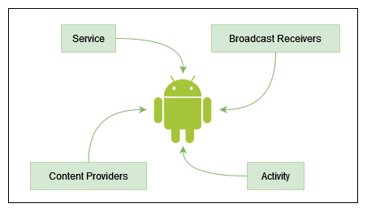
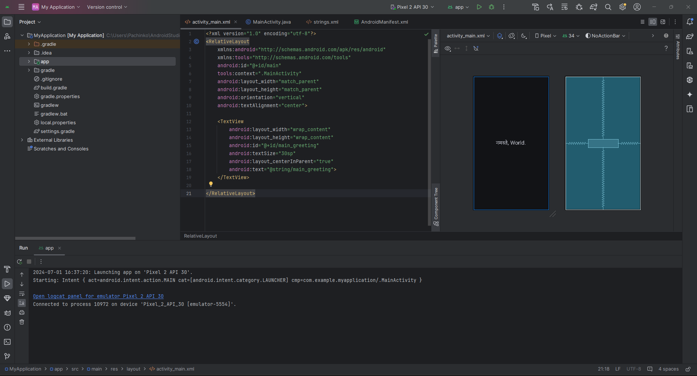
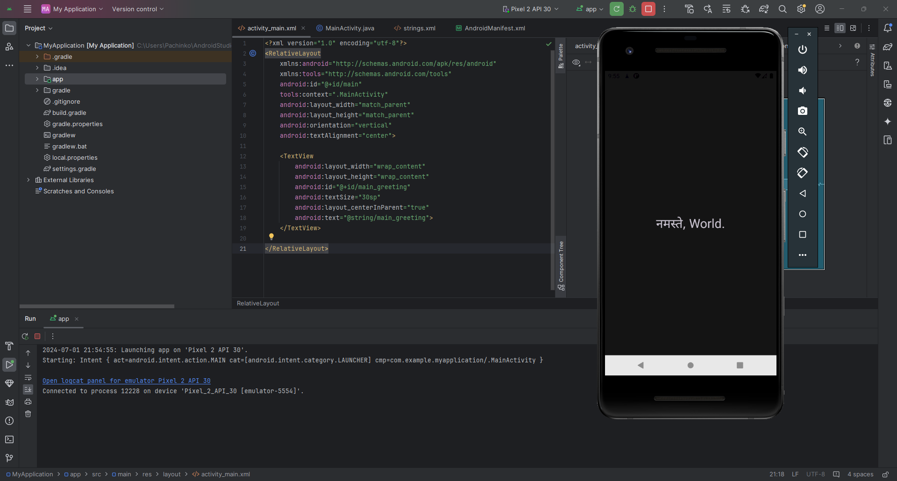

This month I decided to dive into Android application security, and learn how Android application pentests work. This blog is to help me record my progress.

# Android Architecture
The [Android Architecture](https://developer.android.com/guide/platform) consists of the following components:
- **Linux Kernel:** The foundation of the Android OS, providing core system services such as security, memory management, process management, and network stack.
- **Hardware Abstraction Layer (HAL):** Interface for hardware-specific services, enabling the Android OS to communicate with hardware components.
- **Android Runtime (ART)**: Responsible for executing and managing applications, includes core libraries that provide most of the functionality available in the Java programming language.
- **Native C/C++ Libraries:** Libraries used by various components of the Android system and applications.
- **Java API Framework:** Provides APIs for building apps, including support for UI, media, graphics, and more.
- **System Apps:** Pre-installed apps that provide basic functionalities like calling, messaging, and web browsing.


# Android Security Model
The [Android Security Model](https://source.android.com/docs/security) is designed to provide a multi-layered defense-in-depth strategy:

- **Application Sandbox:** Each app runs in its own Linux process and is isolated from other apps.
- **Permissions System:** Apps must declare required permissions in the manifest file, and users must grant these permissions.
- **App Signing:** All apps must be digitally signed by their developer, ensuring the integrity and authenticity of the app.
- **SELinux:** Enhances security by enforcing mandatory access controls over all processes, even the root user. [Reference](https://github.blog/2023-07-05-introduction-to-selinux)
- **Encryption:** Supports full-disk encryption and file-based encryption to protect user data.

# Andorid Application Components
Android apps are built using four main components, each serving a specific purpose:

- **Activities:** Represent a single screen with a user interface. They are the entry point for interacting with the user.
- **Services:** Run in the background to perform long-running operations without user interaction.
- **Broadcast Receivers:** Allow apps to listen and respond to broadcast messages from other apps or the system.
- **Content Providers:** Manage shared app data, allowing different apps to access and modify data securely.



**Reference:** https://developer.android.com/guide/components/fundamentals

# नमस्ते, World!
Know that we know all of that, let's create a simple android application. Create a New Project and select Empty Views Activity (Selecting anything other than Empty Activity is fine, since Empty Activity is created with Jetpack Compose support which only supports Kotlin. I'll probably look at Kotlin some other time).

Most of the required code has already been created. Just create a layout file for the main activity (called `activity_main.xml`) and add the following code to it:

```xml
<?xml version="1.0" encoding="utf-8"?>
<RelativeLayout
    xmlns:android="http://schemas.android.com/apk/res/android"
    xmlns:tools="http://schemas.android.com/tools"
    android:id="@+id/main"
    tools:context=".MainActivity"
    android:layout_width="match_parent"
    android:layout_height="match_parent"
    android:orientation="vertical"
    android:textAlignment="center">

    <TextView
        android:layout_width="wrap_content"
        android:layout_height="wrap_content"
        android:id="@+id/main_greeting"
        android:textSize="30sp"
        android:layout_centerInParent="true"
        android:text="@string/main_greeting">
    </TextView>

</RelativeLayout>
```

In `strings.xml` add the following line to create the string we have referenced to on line #18 in `activity_main.xml`

```xml
<string name="main_greeting">नमस्ते, World.</string>
```

Our final layout looks like this:


Build the application by clicking the build button.
