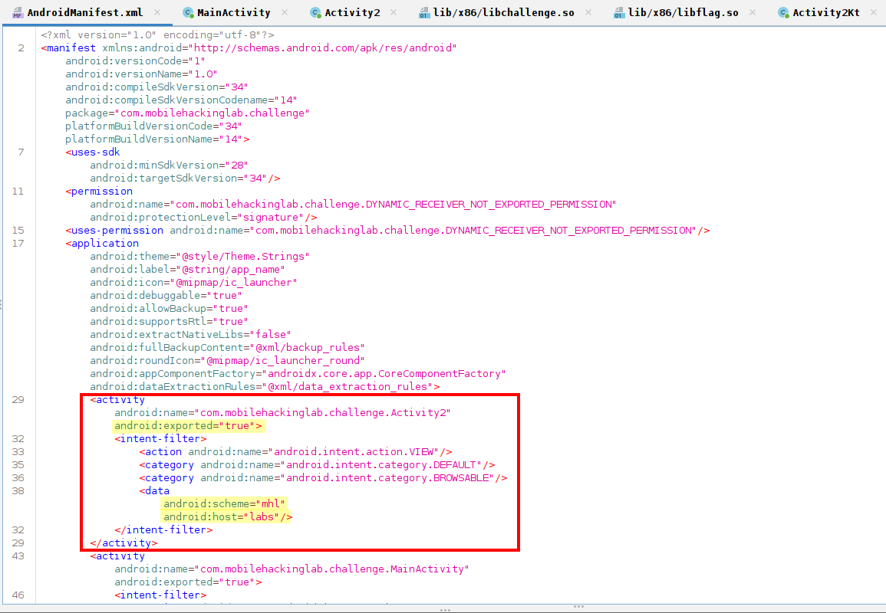
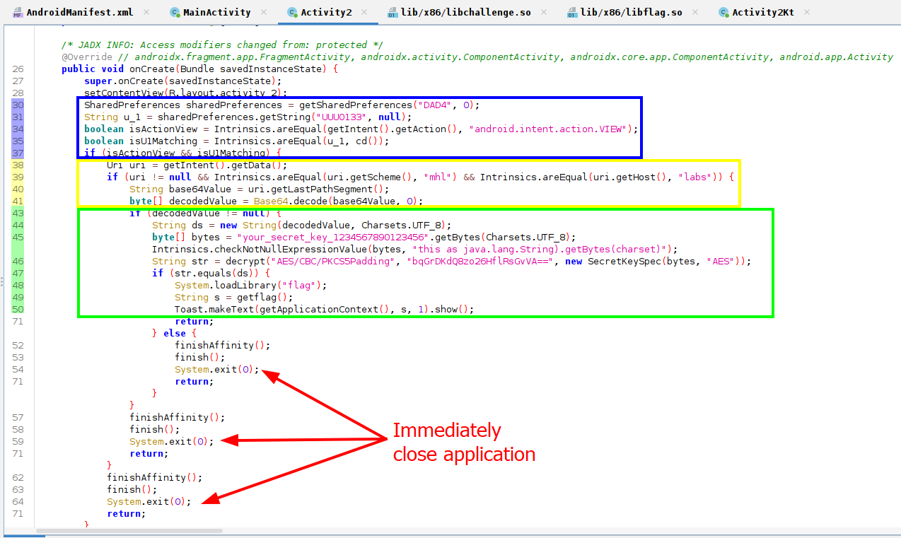
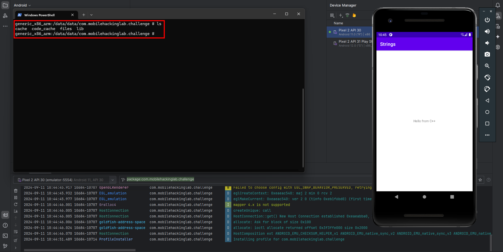
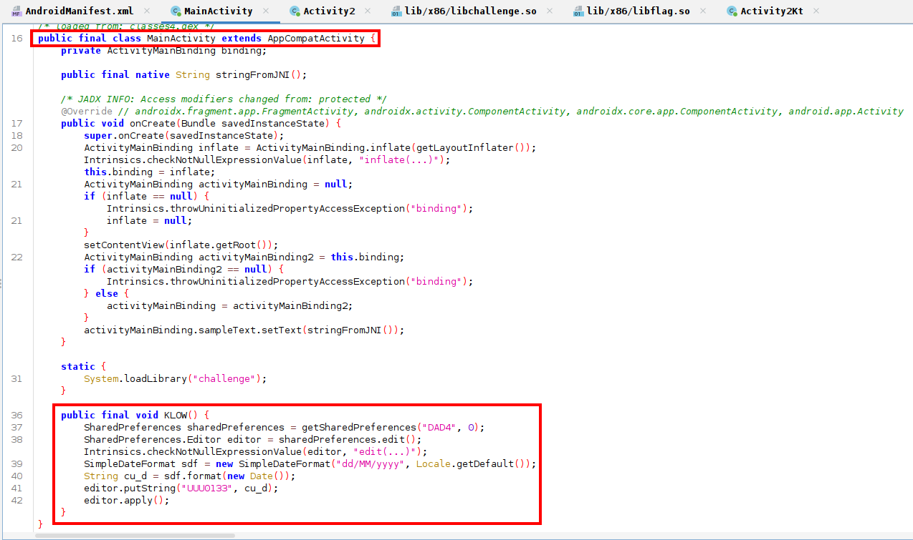
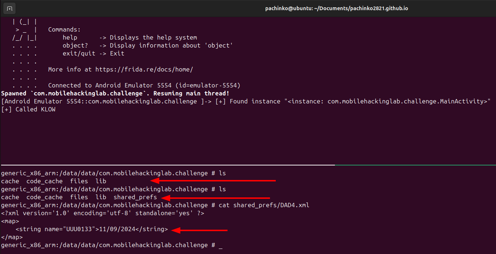
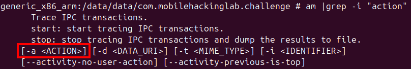
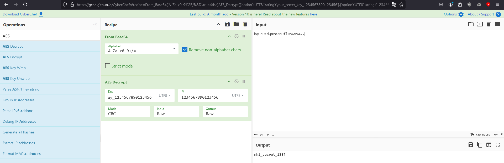
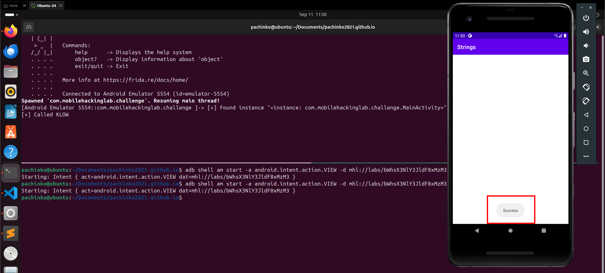
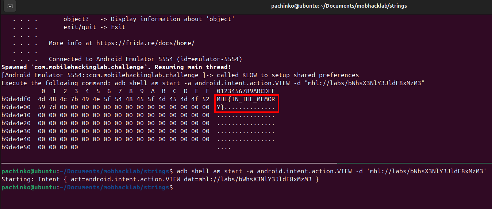

Since that past few weeks, I've been going through the free [Android Application Security course by Mobile Hacking Lab](https://www.mobilehackinglab.com/course/free-android-application-security-course). I would recommend this to you if you are looking to get started with Android Application pentesting. They have great labs as well, which are excellent if you are looking to get your hands dirty. This blog is a writeup for one of their free labs - Strings.

The goal of the lab is to retrieve a flag by finding the correct way to invoke an exported activity, which calls native C/C++ code.

# Analyzing the Application

Looking at the application using JADX-GUI, we see two exported Activities, MainActivity and Activity2. 

Activity2 has a defined deeplink that can be used to invoke it, which overall matches with the theme of the challenge. So I looked at that first.


The path to get the flag is clear - we need to reach the getFlag function call on #L49, which will fetch the flag, and show it as a [Toast](https://developer.android.com/reference/android/widget/Toast#makeText(android.content.Context,%20java.lang.CharSequence,%20int)) for 1 second.


There are 3 hurdles in the way:

- if statement on #L35, ensuring correct values for a shared preference and intent action.
- if statement on #L37, ensuring the activity is launched using a deeplink.
- if statements on #L43 and #L47 ensuring decodedValue matches expected string.

# Shared Preferences and Intent Actions

[SharedPreferences](https://developer.android.com/training/data-storage/shared-preferences) API is used to store key-value pairs in XML files. These files are present in the `shared_perfs` directory in the applications data directory `/data/data/<package-name>/shared_perfs`.

This application checks if the value `UUU0133` in the sharedPreference `DAD4` matches the value returned by the function `Activity2.cd` (Activity2 #L34).

The `shared_perfs` directory does not initially exist when we run the app.


We could create the sharedPreference manually, but a better way is to check if the application has any pre-defined methods to do so. Searching for the strings `UUU0133` and `DAD4` in the source, we see there's a function `MainActivity.KLOW` that does exactly what we need. The only catch is it is never invoked by the MainActivity, only it's definition exists.


We can use Frida's Java API to grab a live instance of `MainActivity` and call `KLOW` directly. The following code is used to do so:
```javascript
Java.perform(() => {
    // Hook MainActivity to call KLOW
    // let c_MainActivity = Java.use("com.mobilehackinglab.challenge.MainActivity");
	setTimeout(() => {
        Java.choose("com.mobilehackinglab.challenge.MainActivity", {
                onMatch: function (instance) {
                	console.log(`[+] Found instance ${JSON.stringify(instance)}`);
                    instance.KLOW();
                },
                onComplete: function() {
                    console.log("[+] Called KLOW");
                }
        });
	}, 2000);
});
```
Run the application with the Frida script attached using `frida -Uf com.mobilehackinglab.challenge -l strings.js`, and the sharedPreferences get populated.


The second half of the first hurdle is to make sure that `Activity2` is launched with the correct [action](https://developer.android.com/reference/android/content/Intent#constants_1), `android.intent.action.VIEW`, as checked on #L33. This is quite easy to achieve, as we can launch the activity directly via the activity manager, and pass the correct action using the `-a` flag.


# Deeplinks
Deep links are URIs of any scheme that take users directly to a specific part of your app. Deeplinks can be defined by adding [intent filters](https://developer.android.com/guide/components/intents-filters) to the android activity in the AndroidManifest.xml file.

The code on #L38-39 in `Activity2` accpets intent data, and checks if the URI matches the pattern `mhl://labs`. It then extracts a value from the URI path (#L40) which is then used for further processing. The if statement on #L43 makes sure this value is not null, and the one on #L47 makes sure it matches a defined value. This makes the final deeplink to use to launch the application as `mhl://labs/<some-string>`

The application uses AES CBC with PKCS5 padding to decrypt a hardcoded string (Activity2 #L46), which is then compared with the value in the deeplink. The key (Activity2 #L45), IV (Activity2Kt #L11) are also hardcoded within the source. We can use this information to decrypt the value ourselves. Another possible method would be to hook the `Activity2.decrypt` function to return a custom value.

I decrypted the hardcoded string using CyberChef, as that approach seems much easier.
.

so the final deeplink becomes `mhl://labs/bWhsX3NlY3JldF8xMzM3` where `bWhsX3NlY3JldF8xMzM3` is `base64(mhl_secret_1337)`

# Getting the flag
The next step would be to launch the application with frida to write the shared_perfs, then invoke `Activity2` using our deeplink. This should invoke the `getFlag` function, and print the flag as a toast.

```sh
frida -Uf com.mobilehackinglab.challenge -l strings.js
adb shell am start -a android.intent.action.VIEW -d mhl://labs/bWhsX3NlY3JldF8xMzM3
```


The toast just says `Success`. So the initial assumption that the `getFlag` function returns the flag was incorrect. At this point I was stuck and decided to take a hint, which as the lab instructions mentioned, was to scan the memory.

Frida has a [memory scanning](https://frida.re/docs/javascript-api/#memory) functionality, which can search for a specific pattern. We need to look for the pattern `MHL{` as that is the flag format. The shared object file `libflag.so` seems like an excellent candidate as it is also loaded by `Activity2` (#L48) before calling the `getFlag` function.
```javascript
	setTimeout(() => {
		let mod = Process.getModuleByName("libflag.so")
	  	let pattern = '4d 48 4c 7b'; // MHL{
	  	let result = Memory.scanSync(mod.base, mod.size, pattern);
	  	let match = result[0].address;
	  	console.log(hexdump(match, {length: 100}))
	}, 10000);
```
This script waits for 10 seconds before the memory is scanned, giving us time to invoke the application and setup shared_perfs and then invoke `Activity2` using our deeplink. The final frida script looks like this:
``` javascript
Java.perform(() => {
	// Hook MainActivity to call KLOW
	// let c_MainActivity = Java.use("com.mobilehackinglab.challenge.MainActivity");
	setTimeout(() => {
		Java.choose("com.mobilehackinglab.challenge.MainActivity", {
			onMatch: function (instance) {
				instance.KLOW();
			},
			onComplete: function() {
				console.log("called KLOW to setup shared preferences");
				console.log('Execute the following command: adb shell am start -a android.intent.action.VIEW -d "mhl://labs/bWhsX3NlY3JldF8xMzM3"');
			}
		});
	}, 1000);

	// Search for flag in memory
	setTimeout(() => {
		let mod = Process.getModuleByName("libflag.so")
	  	let pattern = '4d 48 4c 7b'; // MHL{
	  	let result = Memory.scanSync(mod.base, mod.size, pattern);
	  	let match = result[0].address;
	  	console.log(hexdump(match, {length: 100}))
	}, 10000);
});
```
Frida finds the our flag in memory. `MHL{IN_THE_MEMORY}`
