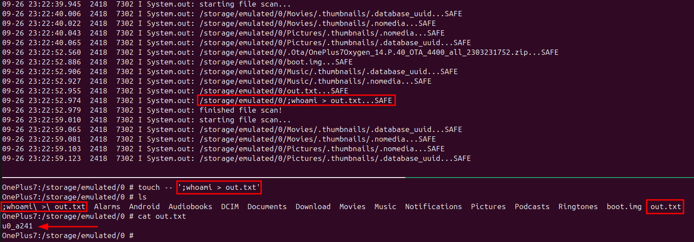

I've been going through the free [Android Application Security course by Mobile Hacking Lab](https://www.mobilehackinglab.com/course/free-android-application-security-course). I would recommend this to you if you are looking to get started with Android Application pentesting. They have great labs as well, which are excellent if you are looking to get your hands dirty. This blog is a writeup for one of their free labs - Cyclic.

The goal of the lab is to exploit a vulnerability inherent within an android virus scanner service to achieve remote code execution (RCE).

# Analyzing the Application

Looking at the source in jadx-gui, I saw there is one service defined in AndroidManifest.xml, called `com.mobilehackinglab.cyclicscanner.scanner.ScanService`.


The Service's `onCreate` method defines a new [Handler](https://developer.android.com/reference/android/os/Handler).


A Handler is associated with a associated with a [Looper](https://developer.android.com/reference/android/os/Looper) and adds [Messages](https://developer.android.com/reference/android/os/Message) to the [MessageQueue](https://developer.android.com/reference/android/os/MessageQueue) that need to be dispatched by the Looper. [r/brandnewsentence](https://www.reddit.com/r/BrandNewSentence/)

We see that this Handler is called in the [onStartCommand](https://developer.android.com/reference/android/app/Service#onStartCommand(android.content.Intent,%20int,%20int)) method of the service.


onStartCommand is invoked everytime the service is started via `Context.startService(Intent)`. Messages sent by the service will be handled by the `handleMessage` method of the Handler defined in the `onCreate` method.


handleMessage seems to be the place where the big things happen. This function fetches the external storage directory using `Environment.getExternalStorageDirectory` function, gets a list of every file in that directory, then calls `ScanEngine.INSTANCE.scanFile` on all files. Then it proceeds to mark them as either `SAFE` or `INFECTED` based on this functions output. The only conditions for something to be scanned are it should be readable, and it should be a file.

# The ScanEngine


The `ScanEngine.scanFile` function builds a string `command` as `toybox sha1sum <filename>`, which is then executed as a command using [ProcessBuilder](https://docs.oracle.com/en/java/javase/21/docs/api/java.base/java/lang/ProcessBuilder.html). This is most definetly our sink, and is a clear command execution vulnerability via a payload in the filename. But lets keep reading further.

The SHA1 hash of the file is then checked against a list of known malicious file hashes, which is just EICAR malware test files in. The function returns `TRUE` or `FALSE` based on if the hashes match.

# Starting The Service

We now know what the vulnerability is but haven't yet figured out how the Service is started. It is not an exported service, so cannot be invoked externally. So there must be some other way it is started.


The MainActivity's `onCreate` method calls `setupPermissionsLauncher` which in turn calls `setupSwitch` whenever a toggle button is checked. This will ask the user for the `android.settings.MANAGE_ALL_FILES_ACCESS_PERMISSION` permission using the `handlePermissions` function.

I started the app and granted it this permission. The service started, and notified me that it is scanning my files regularly.


# Exploit

At this point I realised I had no idea where to place my file. What does `Environment.getExternalStorageDirectory` return? I initially placed a file in /sdcard, but I did not get the output. I decided to look at logcat to see if I can get a clue. There are a bunch of `System.out.println` in `ScanService` that must be going somewhere.

```bash
export pid=$(frida-ps -U |grep -i cyclic |awk '{print $1}')
adb logcat --pid=$pid 
```


So the directory is `/storage/emulated/0`. Let's place a file with the following name in the directory, and see what happens: `;whoami > out.txt`

```sh
adb shell
su
cd /storage/emulated/0
touch -- ';whoami > out.txt'
```

And there we have it.
